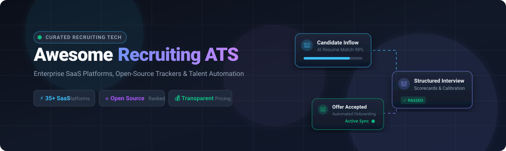

# Awesome Recruiting & ATS Ecosystem 🎯💼

<p align="center">
  
</p>

<p align="center">
  <a href="https://github.com/ishandutta2007/Awesome-Awesome-Awesome"></a><a href="https://discord.gg/jc4xtF58Ve"></a>
  <a href="https://github.com/ishandutta2007/Awesome-Recruiting-ATS/stargazers"></a>
  <a href="https://github.com/ishandutta2007/Awesome-Recruiting-ATS/network/members"></a>
  <a href="https://makeapullrequest.com"></a>
  <a href="LICENSE"></a>
  <a href="https://github.com/ishandutta2007"></a>
</p>

---

## 📖 Overview

A comprehensive, curated landscape of **Applicant Tracking Systems (ATS)**, **Recruiting Software**, **Talent Acquisition Suites**, and **Open-Source Hiring Tools**.

Modern recruitment technology streamlines the entire talent lifecycle: job multi-posting, career page branding, candidate sourcing, resume parsing, candidate scoring, structured interview scheduling, automated scorecards, recruitment CRM, offer letter management, and HRIS/onboarding compliance.

---

## 📑 Table of Contents

- [🏢 SaaS & Commercial ATS Platforms](#-saas--commercial-ats-platforms)
  - [📊 Market Dynamics & Sizing](#-market-dynamics--sizing)
  - [📋 SaaS ATS Platforms Comparison Table](#-saas-ats-platforms-comparison-table)
- [⭐ Open-Source ATS & Recruiting Projects](#-open-source-ats--recruiting-projects)
- [🛠️ Open-Source Infrastructure & Supporting Building Blocks](#️-open-source-infrastructure--supporting-building-blocks)
- [🏗️ Architectural Blueprint for a Custom Open-Source ATS](#️-architectural-blueprint-for-a-custom-open-source-ats)
- [📈 Star History](#-star-history)
- [🤝 How to Contribute](#-how-to-contribute)
- [⚠️ Disclaimer](#️-disclaimer)

---

## 🏢 SaaS & Commercial ATS Platforms

### 📊 Market Dynamics & Sizing

> **Estimated Market Size & Sector Structure:**
> The global **Applicant Tracking System (ATS) & Recruitment Software Market** is currently valued at **~$3.8 Billion to $4.5 Billion** and is projected to reach **$6.2+ Billion by 2030** (growing at a CAGR of **~7.5% - 8.2%**).
> 
> **Market Fragmentation:** The sector is **moderately to highly fragmented** rather than a winner-take-all monopoly. The ecosystem is distinctly split across four major sub-segments:
> 1. **Enterprise HCM Giants** (Oracle, SAP, Workday, UKG) serving global conglomerates with unified payroll and core HR.
> 2. **Enterprise-Grade Pureplay ATS** (Greenhouse, iCIMS, Lever, SmartRecruiters, Avature) dominating structured hiring and high-volume talent acquisition.
> 3. **High-Growth Mid-Market & Scaleup ATS** (Ashby, Workable, BambooHR, Teamtailor, Pinpoint, Breezy HR) offering rapid onboarding and deep developer/modern analytics tooling.
> 4. **AI-First / Sourcing & Staffing Agency Specialists** (Bullhorn, Recruit CRM, JobAdder, Gem, Fetcher, Dover, Metaview, Loxo) capturing specialized niche workflows and automated AI sourcing.

---

### 📋 SaaS ATS Platforms Comparison Table

*The table below is sorted in descending order by **Company Scale (Market Capitalization / Valuation / Annual Recurring Revenue)**.*

| 🏢 Product / Platform | 📝 Description | 📊 Company Scale (Valuation / Revenue) 🔽 | 💵 Starting Pricing | 🎁 Free Tier & Trial Limits |
| :--- | :--- | :--- | :--- | :--- |
| **[Oracle Recruiting](https://www.oracle.com/human-capital-management/recruiting/)** | Enterprise talent acquisition cloud module natively integrated with Oracle Fusion Cloud HCM for global requisition and candidate lifecycles. | **Market Cap: ~$390B+**<br>*(Annual Rev: ~$53B+)* | **$28.00 / employee / month** *(Base HCM suite starting rate; annual minimum commitments apply)* | **No free tier**<br>*(0-day self-serve trial; guided enterprise sales architecture demo only)* |
| **[SAP SuccessFactors Recruiting](https://www.sap.com/products/hcm/recruiting-software.html)** | Global enterprise talent acquisition suite covering global candidate pipelines, multi-country compliance, and onboarding integrated with SAP HCM. | **Market Cap: ~$240B+**<br>*(Annual Rev: ~$34B+)* | **$3.50 / employee / month** *(Recruiting module add-on; enterprise annual contract minimums apply)* | **No free tier**<br>**Free Trial:** 30-day guided evaluation sandbox tenant with sample data. |
| **[Workday Recruiting](https://www.workday.com/en-us/products/talent-management/recruiting.html)** | Enterprise ATS and talent acquisition solution unified with Workday Core HCM for requisition management, internal mobility, and hiring analytics. | **Market Cap: ~$68B+**<br>*(Annual Rev: ~$7.3B+)* | **$34.00 / employee / month** *(Full HCM suite baseline; standalone annual contract minimums start at ~$50,000/yr)* | **No free tier**<br>*(0-day trial; guided enterprise sandbox and executive demo only)* |
| **[UKG Pro Recruiting](https://www.ukg.com/solutions/recruiting)** | Talent acquisition and candidate relationship platform connected directly with UKG HCM, workforce management, and employee records. | **Valuation: ~$35B**<br>*(Annual Rev: ~$2.5B+)* | **$26.00 / employee / month** *(Base PEPM licensing rate; custom implementation and enterprise rollout quote)* | **No free tier**<br>*(0-day trial; personalized live product demonstration only)* |
| **[Rippling Recruiting](https://www.rippling.com/recruiting)** | Native ATS module connecting job requisitions directly with automated background checks, employee onboarding, devices, and payroll. | **Valuation: ~$13.5B**<br>*(ARR: ~$350M+)* | **$8.00 / employee / month** *(Plus $35/month base platform fee; recruiting module add-on)* | **No free tier**<br>*(0-day trial; interactive 1-on-1 walkthrough and guided demo only)* |
| **[Zoho Recruit](https://www.zoho.com/recruit/)** | Flexible ATS and recruitment CRM for corporate HR and staffing agencies with automated resume parsing, multi-board posting, and email sync. | **Valuation: ~$8B–$10B**<br>*(Annual Rev: ~$1.2B+)* | **$25.00 / user / month** *(Standard Plan billed annually; $30/user/mo billed monthly)* | **Free Forever Tier:** 1 recruiter seat, 1 active job opening, 50 candidate records.<br>**Free Trial:** 15-day full Enterprise trial (no credit card required). |
| **[Personio Recruiting](https://www.personio.com/features/recruiting-applicant-tracking-system/)** | European all-in-one HR and applicant tracking platform managing candidate applications, pipeline stages, and employee conversion. | **Valuation: ~$8.5B**<br>*(ARR: ~$200M+)* | **$3.00 / employee / month** *(Core platform entry pricing; tiered by headcount packaging)* | **No free tier**<br>**Free Trial:** 14-day full core platform trial with pre-loaded or custom test hiring pipelines. |
| **[Cornerstone Recruiting](https://www.cornerstoneondemand.com/products/recruiting/)** | Enterprise talent acquisition platform supporting unified recruiting, candidate relationship marketing, and learning/skills management. | **Valuation: ~$5.2B**<br>*(Annual Rev: ~$900M+)* | **$15.00 / employee / month** *(Talent Suite module baseline; annual enterprise minimums apply)* | **No free tier**<br>*(0-day trial; customized corporate proof-of-concept and guided sales demo)* |
| **[Bullhorn](https://www.bullhorn.com/)** | Industry-standard ATS and staffing CRM designed for agencies, placement firms, and executive search teams with end-to-end billing integration. | **Valuation: ~$2.5B–$3.0B**<br>*(Annual Rev: ~$500M+)* | **$99.00 / user / month** *(Bullhorn Starter Plan; Core Plan starts at $165/user/month)* | **No free tier**<br>*(0-day trial; specialized staffing workflow live demo only)* |
| **[iCIMS](https://www.icims.com/)** | Enterprise talent acquisition cloud offering applicant tracking, AI candidate matching, recruitment marketing, and video interviews. | **Valuation: ~$2.5B–$3.0B**<br>*(Annual Rev: ~$400M+)* | **$6.00 / employee / month** *(Or starting tier annual contract baseline of ~$14,500/year)* | **No free tier**<br>*(0-day trial; guided enterprise evaluation and tailored workflow demo)* |
| **[BambooHR](https://www.bamboohr.com/features/applicant-tracking/)** | Modern SMB HR platform with built-in ATS features, automated candidate communication, mobile hiring apps, and offer letter workflows. | **Valuation: ~$2.0B–$3.0B**<br>*(ARR: ~$250M+)* | **$250.00 / month** *(Base flat fee up to 20 employees, or ~$10–$17/employee/month)* | **No free tier**<br>**Free Trial:** 7-day full feature trial with pre-populated candidate sandbox data. |
| **[Greenhouse](https://www.greenhouse.com/)** | Leading structured hiring platform featuring scorecard calibration, automated interview planning, bias mitigation, and 400+ API integrations. | **Valuation: ~$1.5B**<br>*(ARR: ~$180M+)* | **$6,000.00 / year** *(Essential / Core plan starting tier for teams under 50 employees)* | **No free tier**<br>*(0-day self-serve trial; live structured hiring demonstration and consultative scoping)* |
| **[SmartRecruiters](https://www.smartrecruiters.com/)** | Enterprise talent acquisition suite combining ATS, programmatic job advertising, recruiting CRM, and an open marketplace app ecosystem. | **Valuation: ~$1.5B**<br>*(ARR: ~$100M+)* | **$14,995.00 / year** *(Essential tier starting price, or ~$6–$9/employee/month)* | **No free tier**<br>*(0-day self-serve trial; enterprise live sandbox demo)* |
| **[Gem](https://www.gem.com/)** | Full-funnel talent engagement platform combining recruiting CRM, automated email sequences, sourcing analytics, and talent pipeline visibility. | **Valuation: ~$1.2B**<br>*(ARR: ~$50M+)* | **$135.00 / user / month** *(Startup Tier baseline; special 6-month free tier for startups <30 employees)* | **6-Month Free Startup Program:** For companies under 30 employees.<br>**Free Trial:** 7-day guided POC trial during evaluation. |
| **[Avature](https://www.avature.net/)** | Enterprise-grade customizable ATS and CRM for global corporate recruiting, candidate relationship management, and campus hiring. | **Valuation: ~$800M–$1.0B**<br>*(Annual Rev: ~$120M+)* | **$4,120.00 / month** *(Listed G-Cloud baseline of ~£49,450/year for enterprise deployment instances)* | **No free tier**<br>*(0-day trial; customized enterprise workflow demonstration)* |
| **[Lever](https://www.lever.co/)** | Modern ATS + CRM (LeverTRM) providing sourcing, structured interview feedback, automated nurture campaigns, and DEI analytics. | **Valuation: ~$500M+**<br>*(Employ Inc. ARR: ~$160M+)* | **$6,000.00 / year** *(Starter tier baseline for emerging companies, billed annually)* | **No free tier**<br>*(0-day trial; personalized live product walkthrough and evaluation)* |
| **[ClearCompany](https://www.clearcompany.com/)** | Talent management platform featuring ClearRecruit ATS, pre-screening assessments, automated background checks, and onboarding workflows. | **Valuation: ~$400M–$500M**<br>*(Annual Rev: ~$60M+)* | **$60.00 / user / month** *(Or ~$7–$10/employee/month for full talent suite modules)* | **No free tier**<br>*(0-day trial; 1-on-1 personalized solution demo)* |
| **[Jobvite](https://www.jobvite.com/)** | Comprehensive talent acquisition suite providing ATS, recruitment marketing, AI candidate assistance, and employee referral networks. | **Valuation: ~$350M–$450M**<br>*(Employ Inc. ARR: ~$160M+)* | **$400.00 / month** *(Starting tier for growing businesses, or ~$4,000–$5,000/year)* | **No free tier**<br>*(0-day trial; live recruitment suite demo)* |
| **[Ashby](https://www.ashbyhq.com/)** | Modern all-in-one recruiting platform combining ATS, advanced talent analytics, multi-stage scheduling, and candidate sourcing. | **Valuation: ~$300M–$400M**<br>*(ARR: ~$35M+)* | **$350.00 / recruiter / month** *(Growth Plan with 3-seat minimum, or workforce-based Foundations plan)* | **No free tier**<br>*(0-day public trial; customized pilot evaluation and live demo)* |
| **[Workable](https://www.workable.com/)** | All-in-one recruiting and ATS platform offering 200+ job board syndication, AI candidate sourcing (Auto-Suggest), and video interviews. | **Valuation: ~$300M–$400M**<br>*(Annual Rev: ~$55M+)* | **$299.00 / month** *(Starter Plan for up to 20 employees; $360/mo on monthly billing)* | **No free tier**<br>**Free Trial:** 15-day free trial with 1 active job post and full feature access (no credit card required). |
| **[Teamtailor](https://www.teamtailor.com/)** | Employer branding and recruitment platform featuring drag-and-drop career sites, candidate relationship funnels, and automated stages. | **Valuation: ~$250M–$300M**<br>*(ARR: ~$45M+)* | **$199.00 / month** *(Billed annually at ~$2,400/year for entry tier based on company size)* | **No free tier**<br>*(0-day self-serve trial; personalized live career site & ATS demo)* |
| **[Recruitee](https://recruitee.com/)** *(by Tellent)* | Collaborative ATS platform emphasizing customizable visual hiring pipelines, job multi-posting, sourcing extensions, and team scorecards. | **Valuation: ~$150M–$200M**<br>*(Annual Rev: ~$35M+)* | **$199.00 / month** *(Launch Plan, up to 5 active jobs, billed annually)* | **No free tier**<br>**Free Trial:** 18-day free trial with full Launch/Scale feature access (no credit card required). |
| **[Hireology](https://www.hireology.com/)** | Specialized ATS and hiring platform for decentralized, franchise, healthcare, and automotive businesses with integrated verification. | **Valuation: ~$120M–$150M**<br>*(Annual Rev: ~$30M+)* | **$249.00 / month** *(Essentials tier for single-location hiring)* | **No free tier**<br>*(0-day trial; customized live business demo)* |
| **[JobAdder](https://jobadder.com/)** | Cloud recruiting platform for in-house teams and recruitment agencies featuring fast job posting, candidate CRM, and mobile placement tracking. | **Valuation: ~$120M–$150M**<br>*(Annual Rev: ~$35M+)* | **$95.00 / user / month** *(Recruiter Lite starting tier, billed annually)* | **No free tier**<br>*(0-day trial; live agency/corporate demo)* |
| **[JazzHR](https://www.jazzhr.com/)** | Cost-effective SMB applicant tracking system providing fast job posting, resume screening, custom candidate workflows, and e-signatures. | **Valuation: ~$100M–$150M**<br>*(Employ Inc. ARR: ~$160M+)* | **$39.00 / month** *(Hero Plan billed annually at $468/yr, or $75/mo billed monthly)* | **No free tier**<br>**Free Trial:** 14-day free trial with full platform access (no credit card required). |
| **[Pinpoint](https://www.pinpointhq.com/)** | In-house talent acquisition software featuring customizable career pages, interview scheduling, automated onboarding, and multi-entity support. | **Valuation: ~$60M–$100M**<br>*(ARR: ~$12M+)* | **$345.00 / month** *(Annual contract starting at ~$4,000/year for small growing teams)* | **No free tier**<br>*(0-day trial; guided demo with tailored career site mockup)* |
| **[Loxo](https://loxo.co/)** | AI-powered recruitment CRM and ATS featuring proprietary candidate database (Loxo Source), automated outreach campaigns, and job management. | **Valuation: ~$60M–$100M**<br>*(ARR: ~$15M+)* | **$0.00 / month** *(Free Solo Recruiter Plan; Basic Paid Tier starts at $169/user/month)* | **Free Forever Tier:** Unlimited jobs/projects, core ATS/CRM, Chrome extension.<br>**Free Trial:** 7-day free trial on premium AI sourcing features. |
| **[Dover](https://www.dover.com/)** | Modern hiring and ATS operations platform with automated pipeline tracking, structured interview scorecards, and recruiter marketplace. | **Valuation: ~$50M–$80M**<br>*(ARR: ~$8M+)* | **$0.00 / month** *(Core Free ATS; Premium ATS tier starts at $199/month)* | **Free Forever Tier:** Unlimited active jobs, unlimited team members, 100+ job board integrations.<br>**No credit card required.** |
| **[Fetcher](https://www.fetcher.ai/)** | AI-driven recruiting and candidate engagement platform providing automated candidate discovery, LinkedIn integration, and email sequences. | **Valuation: ~$40M–$60M**<br>*(ARR: ~$8M+)* | **$0.00 / month** *(Starter Free Plan; Growth Plan starts at $149/user/month)* | **Free Forever Tier:** Includes Chrome sourcing extension, email sync, up to 50 sourced candidate profiles/mo. |
| **[Metaview](https://www.metaview.ai/)** | AI interview intelligence platform automatically generating structured interview notes, scorecards, and candidate summaries from live calls. | **Valuation: ~$40M–$60M**<br>*(ARR: ~$6M+)* | **$0.00 / month** *(Free Tier; Pro Plan starts at $100/user/month)* | **Free Forever Tier:** AI interview notes and transcriptions for up to 25 conversations per month.<br>**Free Trial:** Custom trial on Pro features. |
| **[Comeet](https://www.comeet.com/)** *(Spark Hire Recruit)* | Highly collaborative recruiting and applicant tracking software with automated interview orchestration and integrated video interviewing. | **Valuation: ~$30M–$50M**<br>*(ARR: ~$8M+)* | **$500.00 / month** *(Annual contract tier tailored for growing mid-market companies)* | **No free tier**<br>*(0-day trial; interactive demo and consultation)* |
| **[ApplicantPro](https://www.applicantpro.com/)** | High-volume SMB applicant tracking software featuring automated job syndication, pre-hire background checks, and compliance tracking. | **Valuation: ~$30M–$50M**<br>*(Annual Rev: ~$12M+)* | **$199.00 / month** *(Entry plan for small business hiring pipelines)* | **No free tier**<br>**Free Trial:** 14-day free sandbox trial upon verified registration. |
| **[ApplicantStack](https://www.applicantstack.com/)** *(Swipeclock)* | Cloud-based applicant tracking and onboarding software for small businesses with pre-built questionnaire templates and text recruiting. | **Valuation: ~$30M–$50M**<br>*(Annual Rev: ~$10M+)* | **$29.00 / month** *(No setup fee, month-to-month flexibility)* | **No free tier**<br>**Free Trial:** 15-day free trial (unlimited jobs & users, view up to 100 applications). |
| **[Breezy HR](https://breezy.hr/)** | Visual, drag-and-drop applicant tracking system with automatic job board distribution, candidate messaging, and interview scheduling. | **Valuation: ~$30M–$45M**<br>*(ARR: ~$10M+)* | **$157.00 / month** *(Startup plan billed annually; $189/mo billed monthly)* | **Free Forever Tier (Bootstrap):** 1 active job opening, 1 active candidate pool, unlimited team users.<br>**Free Trial:** 14-day trial of paid features. |
| **[Recruit CRM](https://recruitcrm.io/)** | Cloud ATS + CRM designed for global staffing agencies with AI resume parsing, candidate scoring, and visual kanban placement pipelines. | **Valuation: ~$30M–$50M**<br>*(ARR: ~$8M+)* | **$85.00 / user / month** *(Pro Plan billed annually; $100/user/mo billed monthly)* | **No free tier**<br>**Free Trial:** Unlimited-duration usage-based free trial (no time limit; test pipelines up to set candidate thresholds). |
| **[Manatal](https://www.manatal.com/)** | AI recruitment software combining applicant tracking, recruitment CRM, candidate enrichment, and compliance tools for agencies and HR teams. | **Valuation: ~$25M–$40M**<br>*(ARR: ~$6M+)* | **$15.00 / user / month** *(Professional Plan billed annually; $19/user/mo billed monthly)* | **No free tier**<br>**Free Trial:** 14-day free trial with full platform access (no credit card required). |
| **[Teamable](https://teamable.com/)** | Employee referral, talent discovery, and recruitment engagement platform designed to turn employee networks into high-quality candidate leads. | **Valuation: ~$20M–$35M**<br>*(ARR: ~$5M+)* | **$249.00 / user / month** *(Essentials Plan baseline quote for corporate talent teams)* | **No free tier**<br>*(0-day trial; guided referral network optimization demo)* |
| **[Homerun](https://www.homerun.co/)** | Design-driven applicant tracking system focused on collaborative hiring workflows, beautiful job pages, and streamlined candidate reviews. | **Valuation: ~$10M–$20M**<br>*(ARR: ~$3M+)* | **$96.00 / month** *(€89/mo billed annually at ~$1,150/yr, or €99/mo billed monthly)* | **No free tier**<br>**Free Trial:** 15-day free trial with full ATS features and job slots (no credit card required). |

---

## ⭐ Open-Source ATS & Recruiting Projects

*The open-source recruiting projects below are sorted in descending order by **GitHub Star Count 🔽**. Click on the star badge beside any repository to inspect its live stargazers on GitHub.*

### 1. [Odoo](https://github.com/odoo/odoo) [](https://github.com/odoo/odoo/stargazers)
- **GitHub Repository:** [`odoo/odoo`](https://github.com/odoo/odoo)
- **License:** `LGPL-3.0`
- **Description:** Comprehensive open-source business application suite featuring a full-featured **Recruitment / ATS module** with kanban applicant pipelines, automated job posting, email gateway integration, resume indexing, and interview evaluations.

### 2. [Reactive Resume](https://github.com/AmruthPillai/Reactive-Resume) [](https://github.com/AmruthPillai/Reactive-Resume/stargazers)
- **GitHub Repository:** [`AmruthPillai/Reactive-Resume`](https://github.com/AmruthPillai/Reactive-Resume)
- **License:** `MIT`
- **Description:** A modern, privacy-focused open-source resume builder designed for candidate resume generation, JSON export, translation, and structured CV lifecycle management.

### 3. [Cal.com](https://github.com/calcom/cal.com) [](https://github.com/calcom/cal.com/stargazers)
- **GitHub Repository:** [`calcom/cal.com`](https://github.com/calcom/cal.com)
- **License:** `AGPL-3.0`
- **Description:** Open-source scheduling infrastructure widely deployed by recruiting teams for candidate screening calls, round-robin panel interviews, and automated calendar synchronization with ATS webhooks.

### 4. [ERPNext](https://github.com/frappe/erpnext) [](https://github.com/frappe/erpnext/stargazers)
- **GitHub Repository:** [`frappe/erpnext`](https://github.com/frappe/erpnext)
- **License:** `GPL-3.0`
- **Description:** Complete open-source ERP platform containing comprehensive staffing, job applicant tracking, staffing plans, interview scheduling, and recruitment lifecycle workflows.

### 5. [Resume Matcher](https://github.com/srbhr/Resume-Matcher) [](https://github.com/srbhr/Resume-Matcher/stargazers)
- **GitHub Repository:** [`srbhr/Resume-Matcher`](https://github.com/srbhr/Resume-Matcher)
- **License:** `Apache-2.0`
- **Description:** AI-powered open-source system that parses resumes and job descriptions using vector embeddings and semantic similarity algorithms to match candidates with open job requisitions.

### 6. [Horilla HRMS](https://github.com/horilla-os/horilla) [](https://github.com/horilla-os/horilla/stargazers)
- **GitHub Repository:** [`horilla-os/horilla`](https://github.com/horilla-os/horilla)
- **License:** `LGPL-2.1`
- **Description:** Open-source HRMS built on Django with recruitment pipelines, candidate stage tracking, onboarding checklists, and interview evaluation management.

### 7. [OpenResume](https://github.com/xitanggg/open-resume) [](https://github.com/xitanggg/open-resume/stargazers)
- **GitHub Repository:** [`xitanggg/open-resume`](https://github.com/xitanggg/open-resume)
- **License:** `MIT`
- **Description:** Modern, open-source resume builder and real-time ATS resume parser built with Next.js and Tailwind CSS for privacy-friendly candidate profile parsing.

### 8. [Frappe HR](https://github.com/frappe/hrms) [](https://github.com/frappe/hrms/stargazers)
- **GitHub Repository:** [`frappe/hrms`](https://github.com/frappe/hrms)
- **License:** `GPL-3.0`
- **Description:** Modern open-source HR and payroll platform featuring job openings management, candidate application scoring, offer creation, and interview feedback records.

### 9. [pyresparser](https://github.com/OmkarPathak/pyresparser) [](https://github.com/OmkarPathak/pyresparser/stargazers)
- **GitHub Repository:** [`OmkarPathak/pyresparser`](https://github.com/OmkarPathak/pyresparser)
- **License:** `GPL-3.0`
- **Description:** Python NLP library for parsing resume documents (PDF, DOCX) to extract names, emails, contact numbers, skills, experience, and educational background.

### 10. [OrangeHRM](https://github.com/orangehrm/orangehrm) [](https://github.com/orangehrm/orangehrm/stargazers)
- **GitHub Repository:** [`orangehrm/orangehrm`](https://github.com/orangehrm/orangehrm)
- **License:** `GPL-2.0`
- **Description:** Established open-source HR platform offering recruitment vacancy administration, candidate history logs, interview management, and hiring workflows.

### 11. [OpenCATS](https://github.com/opencats/OpenCATS) [](https://github.com/opencats/OpenCATS/stargazers)
- **GitHub Repository:** [`opencats/OpenCATS`](https://github.com/opencats/OpenCATS)
- **License:** `GPL-2.0`
- **Description:** Dedicated, full-lifecycle open-source Applicant Tracking System (ATS) and recruitment CRM tailored for staffing agencies and internal recruiters with resume parsing, candidate databases, and custom career portals.

### 12. [freehire](https://github.com/facundoolano/freehire) [](https://github.com/facundoolano/freehire/stargazers)
- **GitHub Repository:** [`facundoolano/freehire`](https://github.com/facundoolano/freehire)
- **License:** `MIT`
- **Description:** Open-source job board crawler and pipeline infrastructure that indexes job postings across Greenhouse, Lever, Ashby, Workday, and iCIMS into normalized data feeds.

### 13. [JSON Resume](https://github.com/jsonresume/jsonresume.org) [](https://github.com/jsonresume/jsonresume.org/stargazers)
- **GitHub Repository:** [`jsonresume/jsonresume.org`](https://github.com/jsonresume/jsonresume.org)
- **License:** `MIT`
- **Description:** Community-driven JSON-schema standard for resumes with export pipelines and themes, enabling developer-friendly candidate data interoperability across hiring systems.

---

## 🛠️ Open-Source Infrastructure & Supporting Building Blocks

The modern recruitment software stack relies heavily on specialized open-source tools for search, vector retrieval, document extraction, workflow automation, and identity management:

| 🧩 Category | 🛠️ Technology / Project | 🌟 GitHub Stargazers Badge | 💡 Recruitment Use Case |
| :--- | :--- | :--- | :--- |
| **Search & Discovery** | **[Elasticsearch](https://github.com/elastic/elasticsearch)** | [](https://github.com/elastic/elasticsearch/stargazers) | Full-text indexed search across millions of candidate resumes, past notes, and job postings. |
| **Search & Discovery** | **[OpenSearch](https://github.com/opensearch-project/OpenSearch)** | [](https://github.com/opensearch-project/OpenSearch/stargazers) | Distributed search and analytics engine for lexical and hybrid candidate filtering. |
| **Vector & AI Matching** | **[Qdrant](https://github.com/qdrant/qdrant)** | [](https://github.com/qdrant/qdrant/stargazers) | High-performance vector database for semantic candidate-to-job matching embeddings. |
| **Vector & AI Matching** | **[Weaviate](https://github.com/weaviate/weaviate)** | [](https://github.com/weaviate/weaviate/stargazers) | AI-native vector database with integrated ML modules for resume semantic search. |
| **Vector & AI Matching** | **[Milvus](https://github.com/milvus-io/milvus)** | [](https://github.com/milvus-io/milvus/stargazers) | Scalable vector search engine for massive corporate candidate talent pools. |
| **Document Ingestion** | **[Apache Tika](https://github.com/apache/tika)** | [](https://github.com/apache/tika/stargazers) | Content detection and text extraction from diverse resume formats (PDF, DOC, RTF). |
| **Document Ingestion** | **[Tesseract OCR](https://github.com/tesseract-ocr/tesseract)** | [](https://github.com/tesseract-ocr/tesseract/stargazers) | Optical Character Recognition engine for parsing scanned resume images and portfolios. |
| **Document Ingestion** | **[PaddleOCR](https://github.com/PaddlePaddle/PaddleOCR)** | [](https://github.com/PaddlePaddle/PaddleOCR/stargazers) | Multi-language document parsing and table extraction for international resumes. |
| **NLP & Entity Extraction** | **[spaCy](https://github.com/explosion/spaCy)** | [](https://github.com/explosion/spaCy/stargazers) | Industrial-strength NLP for extracting skill sets, employer timelines, and education entities. |
| **NLP & Entity Extraction** | **[Transformers](https://github.com/huggingface/transformers)** | [](https://github.com/huggingface/transformers/stargazers) | State-of-the-art LLMs and tokenizers for candidate summarization and JD generation. |
| **Workflow Automation** | **[n8n](https://github.com/n8n-io/n8n)** | [](https://github.com/n8n-io/n8n/stargazers) | Self-hosted workflow automation connecting ATS webhooks, Slack alerts, and email notifications. |
| **Workflow Automation** | **[Temporal](https://github.com/temporalio/temporal)** | [](https://github.com/temporalio/temporal/stargazers) | Durable execution system for interview loops, approval chains, and candidate notifications. |
| **Workflow Automation** | **[Apache Airflow](https://github.com/apache/airflow)** | [](https://github.com/apache/airflow/stargazers) | Data pipeline orchestration for candidate ingestion, analytics reporting, and diversity audits. |
| **Identity & Security** | **[Keycloak](https://github.com/keycloak/keycloak)** | [](https://github.com/keycloak/keycloak/stargazers) | Open-source IAM providing SAML 2.0, OpenID Connect SSO, and role-based access for hiring portals. |
| **Candidate CRM** | **[SuiteCRM](https://github.com/salesagility/SuiteCRM)** | [](https://github.com/salesagility/SuiteCRM/stargazers) | Open-source CRM adaptable for recruitment agency client and talent relationship pipelines. |
| **Candidate CRM** | **[EspoCRM](https://github.com/espocrm/espocrm)** | [](https://github.com/espocrm/espocrm/stargazers) | Highly customizable lightweight CRM framework for candidate databases and client placement. |

---

## 🏗️ Architectural Blueprint for a Custom Open-Source ATS

To construct a scalable, sovereign in-house Applicant Tracking System without proprietary lock-in, combine the following building blocks:

```
                  ┌────────────────────────────────────────┐
                  │          Candidate Experience          │
                  │  (Career Site, Portal, Application UI)  │
                  └───────────────────┬────────────────────┘
                                      │
                                      ▼
                  ┌────────────────────────────────────────┐
                  │            ATS Core Engine             │
                  │       (OpenCATS / Horilla / Odoo)      │
                  └─────────┬──────────────────┬───────────┘
                            │                  │
               ┌────────────┴────┐        ┌────┴────────────┐
               ▼                 ▼        ▼                 ▼
        ┌─────────────┐   ┌────────────┐ ┌────────────┐   ┌────────────┐
        │ PostgreSQL  │   │ OpenSearch │ │   Qdrant   │   │  Keycloak  │
        │ Candidate DB│   │ Full-Text  │ │ Vector AI  │   │  SSO & IAM │
        └─────────────┘   └────────────┘ └────────────┘   └────────────┘
               ▲                 ▲        ▲                 ▲
               └────────────┬────┴────────┴────┬────────────┘
                            │                  │
                  ┌─────────┴──────────────────┴───────────┐
                  │    Document Ingestion & Automation     │
                  │ (Tika / PaddleOCR + spaCy + n8n / Cal) │
                  └────────────────────────────────────────┘
```

1. **Core ATS & Pipeline Management:** Deploy **OpenCATS**, **Horilla HRMS**, or **Odoo Recruitment** for candidate pipeline stages, jobs, and interview scheduling.
2. **Data & Fast Text Search:** Store relational records in **PostgreSQL**; index resumes and notes in **OpenSearch** or **Elasticsearch** for sub-second keyword matching.
3. **Resume Parsing & Ingestion:** Use **Apache Tika** or **PaddleOCR** for document extraction; process skills and experience entities with **spaCy** or **pyresparser**.
4. **Semantic Matching:** Generate embeddings with **Hugging Face Transformers** and query nearest matches via **Qdrant** or **Weaviate**.
5. **Interview Scheduling & Workflow:** Coordinate interview availability with **Cal.com**; orchestrate background verification, Slack notifications, and approval emails with **n8n** or **Temporal**.
6. **Authentication & Compliance:** Secure recruiter access with **Keycloak** role-based access control and strict data privacy retention policies.

---

## 📈 Star History

[](https://star-history.dera.page/#ishandutta2007/Awesome-Recruiting-ATS&type=date&legend=top-left)

---

## 🤝 How to Contribute

Contributions are welcome! Please follow these steps:

1. 🍴 **Fork** this repository.
2. 🌿 **Create a new branch** (`git checkout -b feature/new-recruiting-tool`).
3. 📝 **Add your entry** following the tabular format:
   - For **SaaS Platforms**: Provide name, official link, 1–2 sentence description, company scale/valuation, exact starting tier price, and specific free tier/trial limits.
   - For **Open-Source Repositories**: Provide project name, official GitHub repository link (`owner/repo`), stargazers badge (`style=social&color=white`), license, and description.
4. 🚀 **Submit a Pull Request** with a clear explanation of your change.
5. ⭐ **Star this repository** if you find it helpful!

---

## ⚠️ Disclaimer

- This is a community-curated directory intended for research, education, and talent acquisition technology evaluation.
- All product names, logos, and brands are property of their respective owners.
- Pricing, free tiers, and free trial terms are subject to change by respective vendors. Always verify official websites and vendor documentation prior to purchasing.
- Recruiting software processes highly sensitive Personally Identifiable Information (PII). Ensure all self-hosted and cloud deployments comply with applicable data protection regulations (e.g., GDPR, CCPA, EEOC).

---

<p align="center">
  <sub>Curated with ❤️ by <a href="https://github.com/ishandutta2007">Ishan Dutta</a> and the global open-source recruiting tech community.</sub>
</p>
